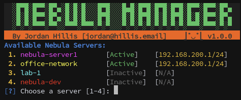
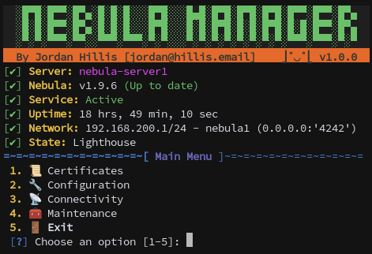
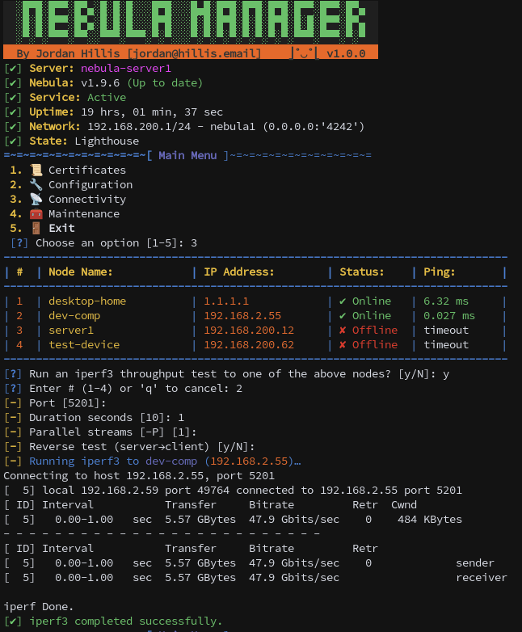
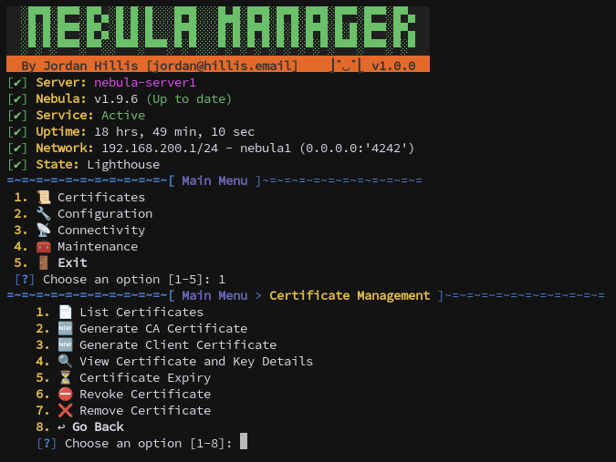
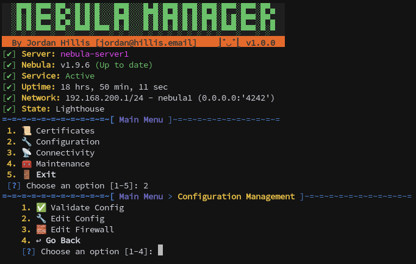
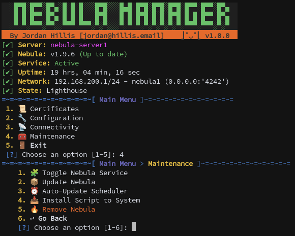

<p align="center"><a href="https://github.com/jordanhillis/nebula-manager/"></a></p>

<p align="center">
  <a href="/LICENSE"></a>
  <a href="https://www.gnu.org/software/bash/"></a>
  <a href="https://kernel.org/"></a>
  <a href="https://github.com/slackhq/nebula"></a>
  <a href="https://github.com/jordanhillis/nebula-manager/commits"></a>
  <a href="https://github.com/jordanhillis/nebula-manager/releases"></a>
</p>

>A fast, interactive CLI tool to **install, configure, and operate** [Slack Nebula](https://github.com/slackhq/nebula) — wrapping certs, firewall policy, service control, connectivity checks, and scheduled updates into one easy-to-use tool.

---

## ⚙️ Features

- 🚀 **Install & Update Nebula** from official releases (arch/OS aware).
- 🛡 **Certificate management** – list, generate, view, remove, check expiry, and **revoke with reasons**.
- 📝 **Configuration management** – interactively edit `config.yml` with validation to prevent bad deploys.
- 🔥 **Firewall management** – control inbound/outbound rules, defaults, and conntrack settings.
- 📡 **Connectivity tools** – multi-node reachability & latency table; optional `iperf3` bandwidth checks.
- 📋 **Service orchestration** – manage all enabled servers, with per-server status.  
- ⏪ **Update Nebula with rollback** if download or config validation fails.  
- ⏰ **Auto-update scheduler** – via cron (`nebula-manager --auto-update-nebula`).  
- 🆕 **First-run setup** – auto-downloads and installs a config template if none exists.  
- ⚙️ **Config-driven multi-server management** via `nebula-manager.conf`.  

---

<details>
  <summary><b>👀 Preview (click to expand)</b></summary>

  <p align="center">
    <a href="resources/img/server-selection.png"></a>
    <a href="resources/img/main-menu.png"></a>
    <a href="resources/img/connectivity-menu.png"></a>
    <br/>
    <a href="resources/img/cert-menu.png"></a>
    <a href="resources/img/config-menu.png"></a>
    <a href="resources/img/maintenance-menu.png"></a>
  </p>
</details>

---

## 📥 Installation

You can run `nebula-manager` either directly from the downloaded script or install it system-wide.

### 🔹 Option 1: Run directly (no install)

```bash
curl -fsSL https://raw.githubusercontent.com/jordanhillis/nebula-manager/refs/heads/main/nebula-manager.sh -o nebula-manager.sh
chmod +x nebula-manager.sh
```

Then run it with:

```bash
sudo ./nebula-manager
```

---

### 🔹 Option 2: Install system-wide (/usr/local/bin)

```bash
sudo curl -fsSL https://raw.githubusercontent.com/jordanhillis/nebula-manager/refs/heads/main/nebula-manager.sh -o /usr/local/bin/nebula-manager
sudo chmod +x /usr/local/bin/nebula-manager
```

Then use it from anywhere with:

```bash
sudo nebula-manager
```

---

## 📦 Dependencies

Nebula Manager will check for and optionally install all required tools on the first run.  
You can skip this check by setting `ignore_dependency_check` in `nebula-manager.conf`, but it is **recommended** to ensure these are installed:  

**Required**: `curl`, `wget`, `tar`, `jq`, `yq`, `systemd` (`systemctl`), `iputils-ping`  
**Optional**: `iperf3` (for bandwidth tests)

---

### Install All Dependencies

** / **  
```bash
sudo apt update
sudo apt install -y awk curl findutils grep jq sed sudo systemd tar wget yq coreutils iperf3 iputils-ping
```
 /  /  / 
```bash
sudo dnf install -y curl findutils grep jq sed sudo systemd tar wget yq coreutils iperf3 iputils
```
(On RHEL-like systems, iputils provides ping.)

---

## 🧩 Configuration: `nebula-manager.conf`

Nebula Manager reads an **INI‑style** config (with sections) located by default at:

```
/etc/nebula/nebula-manager.conf
```

Nebula Manager can run without a pre-existing config file — if none is found, it automatically downloads the template from this repository and saves it to the path specified by the `--config` option or the `SERVER_CONF` variable in the script.

You can change the default **in the script** by editing `SERVER_CONF`, or **without editing the script** by passing a flag:

```
./nebula-manager.sh --config=/path/to/nebula-manager.conf

or 

nebula-manager --config=/path/to/nebula-manager.conf
```

### File Format

- Comments use `#` (inline comments supported).
- Sections use `[global]` and `[server.<name>]`.
- Keys are `key=value`.

#### `[global]` keys

| Key | Description | Default |
|---|---|---|
| `bin_path` | Directory containing `nebula` and where Nebula Manager may install itself. | `/usr/local/bin` |
| `cert_folder` | Relative folder under each server’s Nebula dir to store certs. | `certs` |
| `use_color` | Enable colored output. | `true` |
| `use_icons` | Enable UI icons/symbols. | `true` |
| `disable_version_check` | Skip script version checks. | `false` |
| `ignore_dependency_check` | Skip dependency verification. | `false` |
| `ignore_nebula_update` | Don’t prompt about Nebula updates. | `false` |

#### `[server.<name>]` keys

Each **enabled** server becomes targetable for operations

| Key | Description |
|---|---|
| `dir` | Nebula working dir for this server (e.g., `/etc/nebula/my-edge`). |
| `service` | systemd unit file path for this server (e.g., `/etc/systemd/system/nebula@service`). |
| `enabled` | `true` to include this server in batch operations (restart, checks). |

### Example `nebula-manager.conf`

```ini
[global]
bin_path=/usr/local/bin
cert_folder=certs
use_color=true
use_icons=true
disable_version_check=false
ignore_dependency_check=false
ignore_nebula_update=false

[server.edge-1]
dir=/etc/nebula/edge-1
service=/etc/systemd/system/nebula-edge1.service
enabled=true

[server.lighthouse]
dir=/etc/nebula/lighthouse
service=/etc/systemd/system/nebula-lighthouse.service
enabled=true

[server.lab]
dir=/etc/nebula/lab
service=/etc/systemd/system/nebula-lab.service
enabled=false
```

---

## ➕ Adding & ➖ Removing Servers

**Add a server** by appending a new section to `nebula-manager.conf`:

```ini
[server.edge-2]
dir=/etc/nebula/edge-2
service=/etc/systemd/system/nebula-edge2.service
enabled=true
```

- Ensure the referenced **Nebula dir** contains a valid `config.yml` (the script will download a template one if it doesn't exist).
- Ensure the **systemd unit** exists and points to that config (the script will download a template one if it doesn't exist).

**Disable or remove** a server:

- Set `enabled=false` to temporarily exclude it from batch operations, **or**
- Delete the `[server.<name>]` section to remove it entirely.

---

## 🛠️ Usage

### Menu-driven operations

Run the tool and use the TUI to:

- Manage services (start/stop).
- Edit and **validate** `config.yml` safely.
- Add/remove firewall rules; adjust defaults/conntrack.
- Manage certificates (list/issue/revoke with reasons).
- Check node connectivity & latency; optionally run `iperf3` tests.
- Update Nebula with rollback if something fails.

---

## 📑 CLI Flags (selection)

- `--config=/path/to/nebula-manager.conf` – override config location (no script edits).
- `--auto-update-nebula` – check GitHub for latest Nebula and update if newer.
- `--version` – print script version.

> Many capabilities are menu‑driven. For consistency, prefer the menu unless you have a dedicated automation need.

---

## 📚 Official Nebula resources

If you’re new to Nebula or want the canonical details, start here:

- **Nebula Docs (home):** https://nebula.defined.net/docs/
- **Quick Start:** https://nebula.defined.net/docs/guides/quick-start/
- **Configuration Reference (all keys):** https://nebula.defined.net/docs/config/
- **`static_host_map` explainer:** https://nebula.defined.net/docs/config/static-host-map/
- **Example `config.yml`:** https://raw.githubusercontent.com/slackhq/nebula/master/examples/config.yml
- **Guides (how-tos):** https://nebula.defined.net/docs/guides/
- **Releases (downloads):** https://github.com/slackhq/nebula/releases
- **GitHub repo / Issues / Discussions:** https://github.com/slackhq/nebula

---

## ❓ FAQ

Looking for more answers?

👉 Check out the [Full FAQ on GitHub Wiki »](https://github.com/jordanhillis/nebula-manager/wiki/FAQ)

---

## 🔒 Security Notes
- Always review the script before running it, especially when installing as root.
- Keep backups of your `config.yml` and certificates before making changes.
- Only run Nebula Manager on trusted systems — it manages cryptographic keys.

---

## 📄 License

[MIT](/LICENSE) — free to use, modify, and distribute.

---

## 🤝 Contributing
Pull requests are welcome. For major changes, open an issue first to discuss what you’d like to change.

---

## 🧠 Author

Created by [Jordan Hillis](https://github.com/jordanhillis). Contributions welcome!
